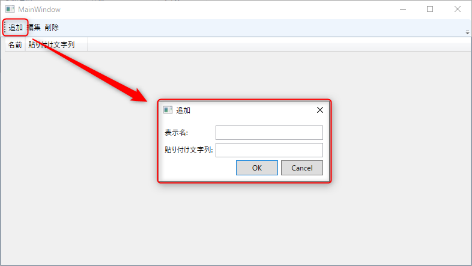
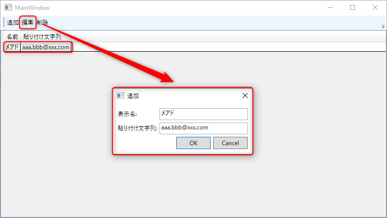
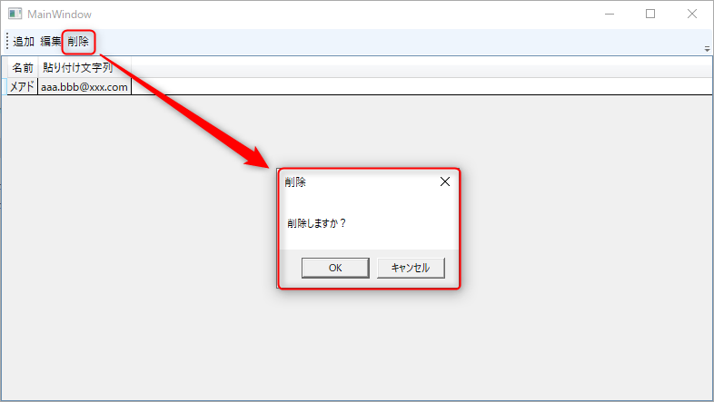
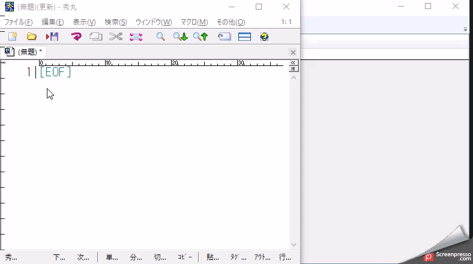

# TemplatePaster
* ペーストしたい文字列を保存しておけるアプリです。

## 概要
### TemplatePasterの特徴
* 頻繁に使用する文字列を保存しておくことで、素早くペーストできます。
* 保存した文字列の一覧をショートカットキーで呼び出すことができます。

### 主なユースケース
* 自身のメールアドレスを記載
* テストでライセンスキーを記載

## 導入方法

TBD

## 使い方

### 文字列を追加する

文字列を追加するには、次の手順で行います。

1. ツールバーの [追加] ボタンを押下します。
1. 表示されたダイアログに「表示名」と「貼り付け文字列」を設定して、[OK] ボタンを押下します。

### 文字列を編集する

文字列を編集するには、次の手順で行います。

1. 編集したい文字列を選択した状態で、ツールバーの [編集] ボタンを押下します。
1. 表示されたダイアログに「表示名」と「貼り付け文字列」を設定して、[OK] ボタンを押下します。

### 文字列を削除する

文字列を削除するには、次の手順で行います。

1. 編集したい文字列を選択した状態で、ツールバーの [削除] ボタンを押下します。
1. 表示されたメッセージボックスで [OK] ボタンを押下します。

### 文字列をペーストする

文字列をペーストするには、次の手順で行います。

1. ペーストしたい場所を選択します。
1. `TemplatePaster` に戻り、ペーストしたい文字列をダブルクリックもしくは、Enterキーを押下します。
    - `TemplatePaster` は`Alt + V`で呼び出すことも可能です。
      （制約：既に`Alt + V`がショートカットに割り当てられているアプリケーションでは、呼び出しできません。）
